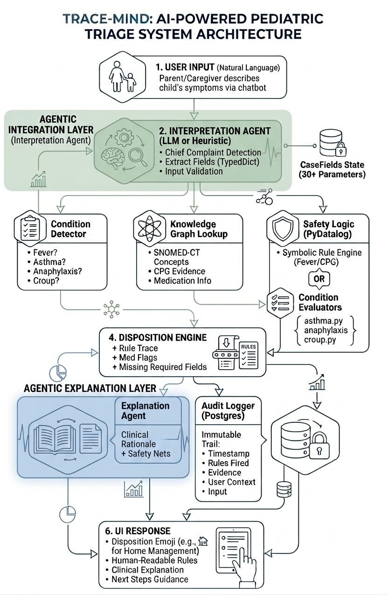

# TraceMind System Architecture

**Version:** 2.0 (Post-Graduation Production Build)  
**Last Updated:** August 2026  
**Status:** Production-Ready Research Prototype

---

## Table of Contents

1. [System Overview](#system-overview)
2. [High-Level Architecture](#high-level-architecture)
3. [Core Components](#core-components)
4. [Data Flow](#data-flow)
5. [Condition Routing](#condition-routing)
6. [Clinical Decision Logic](#clinical-decision-logic)
7. [Knowledge Graph Integration](#knowledge-graph-integration)
8. [Symbolic Reasoning Engine](#symbolic-reasoning-engine)
9. [Security & Audit Architecture](#security--audit-architecture)
10. [Deployment Architecture](#deployment-architecture)
11. [Extension Points](#extension-points)

---

## System Overview

TraceMind is a **neurosymbolic clinical decision support system** for pediatric triage. It combines:

- **Natural Language Processing** (LLM-based interpretation)
- **Symbolic Reasoning** (PyDatalog rules engine)
- **Knowledge Graphs** (SNOMED-CT concepts + CPG evidence)
- **Audit Logging** (immutable decision trails)

### Design Principles

| Principle | Implementation |
|-----------|-----------------|
| **Transparency** | Every decision traces to explicit rules + evidence |
| **Safety** | Fail-safe defaults, contradition detection, multi-validator |
| **Explainability** | Clinical rationale + medication flags for each disposition |
| **Modularity** | Condition-specific evaluators, pluggable KG, swappable LLM |
| **Auditability** | Immutable Postgres trail with timestamps, user context, rules fired |

---

## High-Level Architecture



**Architecture Diagram shows:**
- User input (natural language) → Interpretation Agent
- Condition routing (Fever, Asthma, Anaphylaxis, Croup)
- Clinical decision evaluators for each condition
- Knowledge Graph (Neo4j) retrieval
- Symbolic reasoning engines (PyDatalog + CPG rules)
- Explanation generation + Audit logging
- UI response with disposition, rules, and clinical guidance

---

## Core Components

### 1. Interpretation Agent (`source/agents/interpretation.py`)

**Responsibility:** Convert natural language → structured clinical data

**Inputs:**
- Parent/caregiver free-text messages
- Multi-turn conversation history

**Outputs:**
- `CaseFields` TypedDict with 30+ clinical parameters
- `ExtractedCase` Pydantic model
- Validation warnings (contradictions, out-of-range)

**Implementation:**
- **Mode 1 (Production):** LLM-based with prompt injection defense
- **Mode 2 (Demo/Testing):** Heuristic regex extraction with fuzzy matching

**Key Algorithms:**
- **Keyword extraction:** Fuzzy matching on symptom vocabularies
- **Contradiction detection:** Alert if "no fever" but "fever 105°F"
- **Field accumulation:** Multi-turn consistency (if child was "alert" last turn, only update if new info)
- **Injection defense:** Sanitize lines containing mapping patterns ("should mean", "is equal to")

**Supported Fields (Partial):**
```
Core:
  age_years, age_months, temp_f, weight_kg

Fever-specific:
  vomiting, alertness, breathing, fluid_intake, urine_last_8h, seizure

Asthma-specific:
  wheeze, respiratory_rate, oxygen_saturation, retractions, ability_to_speak

Anaphylaxis-specific:
  urticaria, angioedema, gi_symptoms, hypotension, syncope_or_presyncope

Croup-specific:
  barky_cough, stridor, stridor_type, retractions, croup_duration_hours
```

---

### 2. Condition Detector (`source/logic/triage_rules.py`)

**Responsibility:** Route to correct clinical decision engine based on `chief_complaint`

**Input:** `CaseFields` with `chief_complaint` field

**Output:** Routed to appropriate evaluator

**Routing Logic:**
```python
complaint = case.get("chief_complaint", "fever")  # Default: fever

if complaint == "asthma":
    return evaluate_asthma_triage(case, missing_required)
elif complaint == "anaphylaxis":
    return evaluate_anaphylaxis_triage(case, missing_required)
elif complaint == "croup":
    return evaluate_croup_triage(case, missing_required)
else:
    return _fever_evaluate_triage(case, missing_required)
```

**Backward Compatibility:**
- If `chief_complaint` not set or unknown → defaults to fever triage
- Existing fever-only deployments continue to work

---

### 3. Clinical Decision Evaluators

#### 3.1 Fever Triage (`source/logic/triage_rules.py` - PyDatalog Engine)

**CPG Reference:** NIH/Seattle Children's Hospital

**Severity Stratification:**
- **HOME_MANAGEMENT:** Alert + normal breathing + some fluids + no red flags
- **URGENT_SAME_DAY:** Fever ≥104°F, repeated vomiting + poor fluids, tachypnea, fever >3 days
- **ER_NOW:** Altered alertness, respiratory distress, no fluids + no urine, seizure, infant <3mo

**Implementation:** PyDatalog rules engine with session-scoped facts

**Key Rules:**
- `R_ER_ALERTNESS`: Altered mental status
- `R_URGENT_REPEATED_VOMIT_POOR_FLUID`: Vomiting ≥4x + poor intake
- `R_HOME_CONSERVATIVE`: Alert + normal breathing + fluids + no ER/urgent triggers

---

#### 3.2 Asthma Exacerbation (`source/logic/cpg_asthma.py`)

**CPG Reference:** NIH NAEPP (National Asthma Education & Prevention Program)

**Severity Stratification:**
- **Mild (HOME):**
  - Wheeze with normal O₂ (SpO₂ ≥95%)
  - Full sentences
  - No retractions

- **Moderate (URGENT):**
  - Short phrase speech
  - SpO₂ 90–94%
  - Mild-moderate retractions
  - Moderate RR

- **Severe (ER):**
  - Single words or no speech
  - SpO₂ <90%
  - Severe retractions
  - Prior intubation + wheezing

**Decision Tree:**
```
if (SpO₂ < 90) or (severe retractions + distress) or (single words) → SEVERE
elif (short phrases) or (SpO₂ 90-94) or (moderate retractions) → MODERATE
else → MILD
```

---

#### 3.3 Anaphylaxis / Allergic Reaction (`source/logic/cpg_anaphylaxis.py`)

**CPG Reference:** AAP/AAAAI Guidelines

**Severity Stratification:**
- **Mild (HOME):**
  - Isolated urticaria/itching
  - No swelling
  - Normal breathing

- **Significant Allergic Reaction (URGENT):**
  - Facial/lip angioedema
  - Widespread urticaria
  - Mild GI involvement
  - (No airway/CV involvement)

- **Anaphylaxis (ER/911):**
  - Airway involvement (stridor, wheezing with urticaria)
  - Hypotension or syncope
  - Multi-system: skin + airway/GI/CV
  - Any biphasic pattern risk

**Key Algorithm:** Multi-system assessment
```
has_skin = urticaria or angioedema
has_airway = wheeze or breathing distress
has_gi = vomiting or abdominal pain
has_cv = hypotension or syncope

if stridor or hypotension or airway_angioedema → ANAPHYLAXIS
elif has_skin and (has_airway or has_gi or has_cv) → ANAPHYLAXIS
elif 2+ systemic systems → ANAPHYLAXIS
else → check for significant reaction
```

---

#### 3.4 Croup / Laryngotracheobronchitis (`source/logic/cpg_croup.py`)

**CPG Reference:** AAP Croup Management (Westley Scoring Concept)

**Severity Stratification:**
- **Mild (HOME):**
  - Barky cough
  - Inspiratory stridor only (with crying/agitation)
  - Normal breathing at rest
  - SpO₂ ≥96%

- **Moderate (URGENT):**
  - Stridor at rest
  - Mild-moderate retractions
  - SpO₂ 94-95%
  - Dexamethasone indicated

- **Severe (ER):**
  - Severe stridor + retractions
  - SpO₂ <92%
  - Single-word speech
  - Biphasic/expiratory stridor
  - Possible epiglottitis (fever + stridor + drooling)

**Decision Tree:**
```
if (biphasic/expiratory stridor) or (SpO₂ < 92) or (severe retractions) → SEVERE
elif (stridor at rest) or (moderate retractions) → MODERATE
else → MILD
```

---

### 4. Knowledge Graph Retrieval (`source/graph/`)

**Components:**
- `neo4j_client.py` — Neo4j driver + connection pooling
- `snomed_retrieval.py` — SNOMED-CT concept lookups
- `kg_loader.py` — Populate Neo4j with CPG evidence
- `fever_cpg_mentions.py` — Fever-specific mention mapping

**Data Model:**
```
Neo4j Nodes:
  ┌─ Concept
  │  ├─ name: "Wheeze"
  │  ├─ conceptId: "SCTID-1234567"
  │  └─ description: "Sound of air passing through narrow airways"
  │
  ├─ CPGMention
  │  ├─ ruleId: "R_ASTHMA_MODERATE_URGENT"
  │  ├─ evidence: "Moderate retractions indicate moderate exacerbation"
  │  └─ cpgReference: "NIH NAEPP"
  │
  └─ MedicationFlag
     ├─ name: "CALL_911_IMMEDIATE_EPINEPHRINE"
     └─ indication: "Anaphylaxis with airway involvement"

Relationships:
  CONCEPT -[:INDICATES]-> CPGMention
  CPGMention -[:MENTIONS]-> Concept
```

**Retrieval Pattern:**
1. Extracted concept (e.g., "wheeze")
2. Query Neo4j for related SNOMED-CT concepts
3. Fetch associated CPGMentions (rules that apply)
4. Return evidence + medication info to explanation agent

---

### 5. Symbolic Reasoning Engine

#### 5.1 PyDatalog (Fever Triage)

**Language:** Datalog (declarative logic programming)

**Example Rule:**
```python
rule_fired(S, "R_HOME_CONSERVATIVE") <= (
    cf(S, "alertness", "normal")
    & cf(S, "breathing", "normal")
    & ~cf(S, "fluid_intake", "none")
    & ~er_now(S)
    & ~urgent_same_day(S)
)
```

**Advantages:**
- Explicit, auditable rules
- No black-box learning
- Fast inference

**Thread Safety:**
- Session-scoped facts: `cf(session_id, field_name, value)`
- Per-thread initialization: `_ensure_thread_initialized()`

#### 5.2 Condition-Specific Evaluators (Python Logic)

**Asthma, Anaphylaxis, Croup** use direct Python decision logic:
- Readable if/elif chains
- No separate rule language needed
- CPG thresholds hardcoded (maintainable)

**Example (Asthma):**
```python
def _is_severe_exacerbation(case):
    if case.get("oxygen_saturation") < 90:
        return True
    if case.get("retractions") == "severe":
        return True
    if case.get("ability_to_speak") == "single_words":
        return True
    return False
```

---

### 6. Explanation Agent (`source/agents/explanation.py`)

**Responsibility:** Generate human-readable clinical rationale

**Inputs:**
- `TriageDecision` object (disposition, rules fired, med flags)
- `CaseFields` (patient data)
- KG annotations (evidence from Neo4j)

**Outputs:**
- Clinical explanation (markdown)
- Medication flags & safety netting
- Evidence links (what rules fired, why)

**Templates:**
- Fever explanation: CPG severity + medication guidance
- Asthma explanation: Severity level + oxygen status + medication
- Anaphylaxis explanation: System involvement + epinephrine alerts
- Croup explanation: Westley concept + dexamethasone + airway monitoring

**Medication Flags:**
- `beta_blocker_contraindicated` (asthma)
- `CALL_911_IMMEDIATE_EPINEPHRINE` (anaphylaxis)
- `dexamethasone_0.6mg_per_kg` (croup)
- `dehydration_avoid_nsaid_or_use_with_caution` (fever + dehydration)

---

### 7. Audit & Security (`source/audit/`)

**Component:** `postgres_logger.py`

**Immutable Trail Captures:**
- Timestamp
- User/session ID
- Input text (caregiver message)
- Extracted CaseFields
- Chief complaint
- Condition evaluator used
- Rules fired
- Disposition
- KG annotations retrieved
- Medication flags
- Explanation text

**Schema:**
```sql
CREATE TABLE audit_trail (
    id BIGINT PRIMARY KEY,
    timestamp TIMESTAMP DEFAULT NOW(),
    session_id VARCHAR,
    user_input TEXT,
    case_fields JSONB,
    chief_complaint VARCHAR,
    disposition VARCHAR,
    rules_fired TEXT[],
    med_flags TEXT[],
    kg_concepts JSONB,
    explanation TEXT,
    created_at TIMESTAMP DEFAULT NOW()
);
```

**Security Features:**
- Append-only (no updates/deletes)
- Immutable via Postgres constraints
- Timezone-aware timestamps
- GDPR-compliant data retention policies

---

## Data Flow

### Single-Turn Flow

```
Turn Text: "My 5-year-old has a barky cough"
    ↓
[Interpretation Agent]
    - Detect "barky cough" → chief_complaint = "croup"
    - Extract: barky_cough="yes"
    ↓
[Condition Detector]
    - Route to croup evaluator
    ↓
[Croup CPG Evaluator (cpg_croup.py)]
    - _is_mild_croup(case)? 
    - _is_moderate_croup(case)?
    - _is_severe_croup(case)?
    → Returns: TriageDecision(disposition="HOME_MANAGEMENT", ...)
    ↓
[Explanation Agent]
    - Lookup _RULE_META["R_CROUP_MILD_HOME"]
    - Build markdown explanation
    ↓
[Audit Logger]
    - Record entire interaction
    ↓
[UI Response]
    - Display disposition + explanation
```

### Multi-Turn Accumulation

```
Turn 1: "My 5-year-old has a barky cough"
    ↓
    Extract: barky_cough="yes"
    case = {barky_cough: "yes", ...}

Turn 2: "He has stridor even at rest"
    ↓
    Extract: stridor="yes", stridor_type="at_rest"
    case = {barky_cough: "yes", stridor: "yes", stridor_type: "at_rest", ...}
    Re-evaluate with accumulated fields
    ↓
    Disposition may upgrade: HOME → URGENT

Turn 3: "O2 is 94%, chest retractions visible"
    ↓
    Extract: oxygen_saturation=94, retractions="moderate"
    case = {..., oxygen_saturation: 94, retractions: "moderate"}
    Re-evaluate
    ↓
    Disposition confirmed: URGENT_SAME_DAY
```

---

## Condition Routing

### Chief Complaint Detection

Inferred from keywords with priority order:
1. **Anaphylaxis** (highest priority): "allergy", "swelling", "hives", "stridor + hives"
2. **Croup**: "barky cough", "seal cough", "croup"
3. **Asthma**: "wheeze", "asthma", "breathing trouble"
4. **Fever** (default): "fever", "temperature", "hot"

### Example Decision Tree

```
Input: "My child has hives and is wheezing after eating peanuts"

1. Detect "hives" + "wheeze" → anaphylaxis priority
2. Route to: evaluate_anaphylaxis_triage()
3. Extract: urticaria="yes", wheeze="yes", allergen_exposure="peanuts"
4. Evaluate:
   - has_skin=True (urticaria)
   - has_airway=True (wheeze)
   → Multi-system → ANAPHYLAXIS → ER_NOW
5. Return: TriageDecision(disposition="ER_NOW", rules=[R_ANAPHYLAXIS_ER, ...])
```

---

## Clinical Decision Logic

### Disposition Outcomes

All 4 conditions map to 3 dispositions:

| Disposition | Severity | Action |
|-------------|----------|--------|
| **HOME_MANAGEMENT** | Mild | Safe to manage at home with parental education |
| **URGENT_SAME_DAY** | Moderate | Seek same-day evaluation (urgent care/ED) |
| **ER_NOW** | Severe | Call 911, go to ED immediately |
| **OUT_OF_SCOPE** | Insufficient data | Missing required fields, intake declined, or undetermined |

### Rule Metadata (`source/agents/explanation.py`)

Each rule has a triple: `(human_label, condition_description, cpg_basis)`

**Example:**
```python
"R_ASTHMA_MODERATE_URGENT": (
    "Moderate asthma exacerbation",
    "moderate symptoms with work of breathing",
    "NIH NAEPP CPG: moderate retractions or short phrases → urgent same-day"
)
```

**Display in UI:**
```
Rules Fired:
Moderate asthma exacerbation, Moderate retractions with asthma
```

---

## Knowledge Graph Integration

### Architecture

```
Neo4j Instance (Cloud or Local)
    ↓
[kg_loader.py]
    - Create Concept nodes (SNOMED-CT IDs)
    - Create CPGMention nodes (rules + evidence)
    - Create relationships
    ↓
[snomed_retrieval.py]
    - Query by concept name ("wheeze")
    - Return related SNOMED-CT concepts
    - Fetch associated CPGMentions
    ↓
[Explanation Agent]
    - Annotate with KG evidence
    - Display in UI/explanation
```

### Example Neo4j Nodes

**Fever CPG:**
- Concept: "Fever"
- CPGMention: "Infant <3mo with temp >100.4°F → ER immediately"
- Rule: "R_CPG_INFANT_UNDER_3MO_FEVER"

**Asthma CPG:**
- Concept: "Wheeze"
- CPGMention: "Wheeze + SpO₂ <90% → ER immediately"
- Rule: "R_ASTHMA_HYPOXIA_ER"

**Anaphylaxis CPG:**
- Concept: "Angioedema"
- CPGMention: "Airway angioedema → anaphylaxis → CALL 911"
- Rule: "R_ANAPHYLAXIS_ANGIOEDEMA_AIRWAY_ER"

---

## Security & Audit Architecture

### Input Validation

**Multi-Layer Defense:**

1. **Heuristic Extraction** (`interpretation.py`)
   - Regex patterns (e.g., temp: `\d{2,3}(?:\.\d+)?`)
   - Fuzzy keyword matching
   - Contradiction detection (flag "no fever" + "fever 105°F")

2. **Range Validation** (state.py)
   - Temp: 95–108°F
   - Age: 0–18 years
   - SpO₂: 0–100%
   - Rejects implausible values (e.g., 250°F)

3. **Prompt Injection Defense** (interpretation.py)
   - Pattern matching for injection signals
   - Sanitize lines with mapping keywords
   - Block rule redefinition attempts

4. **LLM Injection Defense** (if using LLM mode)
   - Jailbreak-resistant prompt template
   - Output validation via Pydantic schema
   - Extraction guardrails

### Audit Trail

**Immutable Postgres table** captures:
```json
{
  "timestamp": "2026-08-18T14:32:15Z",
  "session_id": "sess-abc123",
  "user_input": "My 5-year-old has a barky cough",
  "case_fields": { "barky_cough": "yes", ... },
  "chief_complaint": "croup",
  "disposition": "HOME_MANAGEMENT",
  "rules_fired": ["R_CROUP_MILD_HOME", "R_CROUP_BARKY_COUGH_HOME"],
  "med_flags": ["humidified_air_supportive_care"],
  "kg_concepts": [{"concept": "Barky Cough", "SCTID": "..."}],
  "explanation": "..."
}
```

---

## Deployment Architecture

### Development Mode

```
User Input (CLI or Jupyter)
    ↓
[Mock LLM or Heuristic Extraction]
    ↓
[In-Memory State]
    ↓
[Local PyDatalog Engine]
    ↓
[Neo4j Optional]
    ↓
Console Output
```

### Production Mode

```
Streamlit Web UI
    ↓
[FastAPI Backend] (optional)
    ↓
[LLM Service] (OpenAI/Claude API)
    ↓
[Symbolic Reasoning Engine]
    ↓
[Neo4j Instance] (cloud)
    ↓
[Postgres Audit Trail] (Neon)
    ↓
Web Response + Explanation
```

### Environment Variables

```bash
# LLM
OPENAI_API_KEY=sk-...
TRACEMIND_USE_LLM=1

# Neo4j
NEO4J_URI=bolt://localhost:7687
NEO4J_USERNAME=neo4j
NEO4J_PASSWORD=...

# Postgres Audit
DATABASE_URL=postgresql://...

# Demo Mode
TRACEMIND_MOCK_LLM=1           # Use heuristic extraction
TRACEMIND_SKIP_NEO4J=1         # Skip KG retrieval
```

---

## Extension Points

### Adding a New Condition

To add a 5th condition (e.g., "Bronchiolitis"):

1. **Extend CaseFields** (`state.py`):
   ```python
   "bronchiolitis_specific_field": str | None,
   "lower_respiratory_symptoms": str,
   ```

2. **Create CPG Module** (`source/logic/cpg_bronchiolitis.py`):
   ```python
   def evaluate_bronchiolitis_triage(case, missing_required):
       # Decision logic here
       return TriageDecision(...)
   ```

3. **Update Condition Routing** (`triage_rules.py`):
   ```python
   elif complaint == "bronchiolitis":
       return evaluate_bronchiolitis_triage(case, missing_required)
   ```

4. **Add Rule Metadata** (`explanation.py`):
   ```python
   "R_BRONCHIOLITIS_MILD_HOME": (
       "Mild bronchiolitis",
       "...",
       "AAP CPG: ..."
   )
   ```

5. **Add KG Concepts** (`kg_loader.py`):
   ```python
   # Create bronchiolitis concepts in Neo4j
   ```

6. **Update Interpretation** (`interpretation.py`):
   ```python
   # Add keyword detection for bronchiolitis
   if any(x in t for x in ("bronchiolitis", "rsv", "wheezing in infant")):
       out["chief_complaint"] = "bronchiolitis"
   ```

7. **Add Test Scenarios** (`Docs/PRESET_SCENARIOS.txt`):
   ```
   3 new scenarios (mild/urgent/ER)
   ```

---

## Performance Characteristics

| Operation | Typical Time | Notes |
|-----------|--------------|-------|
| Interpretation (heuristic) | <50ms | Regex + keyword extraction |
| Condition Routing | <5ms | Simple string matching |
| CPG Evaluation | <10ms | Direct logic |
| PyDatalog (Fever) | <20ms | Session-scoped facts |
| KG Retrieval (Neo4j) | 100-500ms | Network roundtrip |
| Audit Log Write | 50-100ms | Postgres insert |
| **Total Request** | **200-700ms** | End-to-end (with KG) |

---

## Testing Strategy

### Unit Tests
- Extraction accuracy (heuristic vs expected CaseFields)
- CPG rule firing (each condition)
- Contradiction detection
- Injection defense

### Integration Tests
- End-to-end flows (all 12 preset scenarios)
- Multi-turn accumulation
- KG retrieval + explanation
- Audit logging

### Security Tests
- 6 LLM prompt injection vectors
- 19 adversarial attack cases
- Input validation (out-of-range, type mismatches)
- Contradiction injection attempts

---

## References

### Clinical Guidelines

- **Fever:** [Seattle Children's Hospital Fever Guideline](https://www.seattlechildrens.org/)
- **Asthma:** [NIH NAEPP Asthma Management](https://www.nhlbi.nih.gov/asthma/)
- **Anaphylaxis:** [AAP/AAAAI Anaphylaxis Guidelines](https://www.aap.org/)
- **Croup:** [AAP Croup Management](https://www.aap.org/)

### Technologies

- **LLM:** OpenAI API / Claude / Custom fine-tuned model
- **Symbolic Reasoning:** PyDatalog (Datalog in Python)
- **KG:** Neo4j (SNOMED-CT + CPG evidence)
- **Audit:** Postgres (Neon)
- **Orchestration:** LangGraph (LangChain)
- **UI:** Streamlit (Python web framework)

---

## Disclaimer

TraceMind is a **research prototype** demonstrating secure, explainable neurosymbolic AI in healthcare. It is **not a medical diagnostic tool** and should not replace clinical judgment or professional medical evaluation. Always seek direct clinical assessment for pediatric emergencies.

---

**End of Architecture Document**
